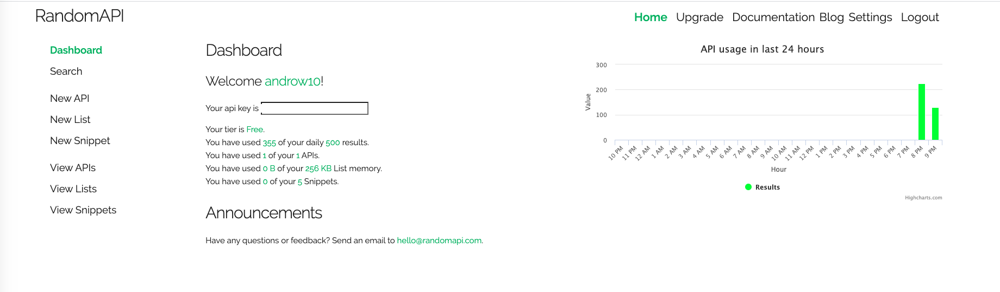
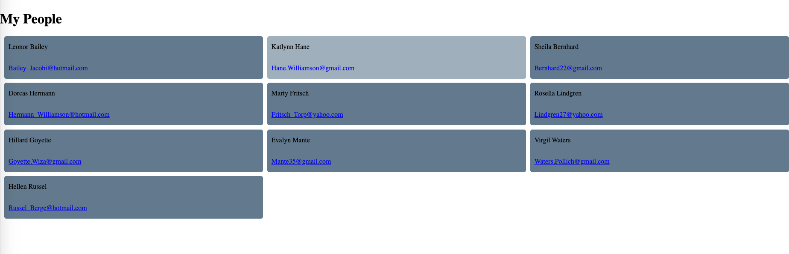

# My-People-Handlebars-API-Project
My people project include the usage of handlebars as well as the Random User api
https://randomuser.me/

api code consisting of:
```
var faker = require('faker'); // Faker.js

const first = faker.name.firstName()
const last = faker.name.lastName()

api.people  = {
    name:  `${first} ${last}`,
    email:  faker.internet.email(last),
};
```



